# 🌿 Anny's Plantitas — Architecture Documentation

**Project:** Anny's Plantitas
**Platform:** Desktop + Mobile (iOS / Android / Web)
**Initial plant catalog:** 200+ plantas
**Version:** 0.2 — Gaps Resolved

> **What changed in v0.2:** Monorepo structure adopted (Turborepo + Next.js + Expo); all open items from v0.1 resolved; security gaps (JWT storage, per-user rate limiting), data model gaps (image dimensions, notification fields, audit log), and missing infrastructure (push scheduler, offline strategy, i18n, admin panel absorbed into Next.js) addressed throughout.

---

## Monorepo Structure

The project uses a **Turborepo** monorepo. Expo Web is dropped in favour of a Next.js app for SEO, ISR, and the admin panel. Business logic, types, DB schemas, and validation are shared via internal packages.

```text
plantitas-monorepo/
├── apps/
│   ├── native/          # Expo / React Native (iOS & Android)
│   ├── web/             # Next.js (public catalog + admin panel)
│   └── api/             # Node.js + Express (REST API for mobile)
├── packages/
│   ├── core/            # Shared business logic, state machines, utilities
│   ├── db/              # Mongoose schemas, connection logic, seed scripts
│   ├── types/           # Shared TypeScript interfaces & Zod schemas
│   └── ui/              # Optional: NativeWind / Tamagui shared primitives
├── package.json
└── turbo.json
```

### Key monorepo decisions

- **Zod everywhere** — `packages/types` defines all Zod schemas (plant, user, search filters). Imported into Next.js forms, Expo forms (via `react-hook-form`), and Express `MW_Valid`. Schema changes propagate instantly via TypeScript.
- **Mongoose in `packages/db`** — Next.js Server Components query MongoDB directly for read-only public catalog pages (bypassing the Express layer). The mobile app always goes through the Express API.
- **Admin panel lives in `apps/web`** — under `app/(admin)/admin/*` behind a protected route layout. No third deployment or separate SPA.
- **UI sharing is pragmatic** — Next.js uses semantic HTML + Tailwind; Expo uses native components. Shared only if using NativeWind/Tamagui; otherwise share data hooks, state, and Zod types only.

---

## Architecture Diagram

```mermaid
%%{init: {'theme': 'forest', 'themeVariables': { 'fontSize': '14px' }}}%%
flowchart TD

    %% ─── ACTORS ──────────────────────────────────────────────────
    GuestUser(["👤 Guest User"])
    AuthUser(["🔐 Auth User"])
    AdminUser(["🛡️ Admin User"])

    %% ─── WEB LAYER (Next.js) ─────────────────────────────────────
    subgraph Web_Layer ["🌐 Web App — Next.js (apps/web)"]
        direction TB

        subgraph Web_Public ["Public Routes (SSR / ISR)"]
            WP_Home["🏠 Home / Discovery (SSR)"]
            WP_Browse["🌿 Browse by Category (ISR)"]
            WP_Detail["🔍 Plant Detail (ISR · generateStaticParams)"]
            WP_Search["🔎 Search Page (SSR)"]
        end

        subgraph Web_Admin ["Admin Routes — /admin/* (Server-Protected)"]
            WA_Plants["🌱 Plant CRUD & Bulk Import"]
            WA_Media["🖼️ Media Management"]
            WA_Taxonomy["🗂️ Taxonomy / Categories"]
            WA_Users["👤 User Management"]
        end

        subgraph Web_Auth ["Auth (NextAuth.js)"]
            WA_Auth["🔑 Login / Register"]
            WA_Session["Session (HttpOnly cookie)"]
        end

        WEB_DB["Direct DB Access\n(packages/db · read-only public routes)"]
        WEB_API["Express API Client\n(authenticated writes / mutations)"]
        WEB_ISR["On-demand Revalidation\n(admin triggers revalidatePath)"]
    end

    %% ─── NATIVE LAYER (Expo) ─────────────────────────────────────
    subgraph Native_Layer ["📱 Native App — Expo (apps/native)"]
        direction TB

        subgraph UI_Screens ["Screen Components"]
            SC_Home["🏠 Home / Discovery Feed"]
            SC_Browse["🌿 Browse by Category"]
            SC_Detail["🔍 Plant Detail View"]
            SC_Search["🔎 Search & Filter"]
            SC_Collection["📚 My Collection"]
            SC_Profile["👤 Profile & Settings"]
            SC_Auth["🔑 Login / Register / Guest"]
            SC_Notif["🔔 Notification Preferences"]
        end

        subgraph App_Logic ["App Logic (packages/core)"]
            BL_Auth["Auth Guard\n(JWT check, guest mode)"]
            BL_Pin["Pin / Track Logic\n(optimistic update)"]
            BL_Collection["Collection Manager"]
            BL_Filter["Facet Filter Engine"]
            BL_Search["Search Orchestrator"]
            BL_Offline["Offline Cache Handler\n(pinned plants only)"]
            BL_Notif["Notification Logic\n(token reg, prefs)"]
            BL_I18n["i18n Module\n(expo-localization + i18next)"]
        end

        subgraph State_Layer ["State — Zustand (packages/core)"]
            ST_Plants["plantsSlice\n(catalog, pagination)"]
            ST_User["userSlice\n(profile, JWT, guestFlag, locale)"]
            ST_Collection["collectionSlice\n(pinned, owned plants)"]
            ST_UI["uiSlice\n(loading, modals, errors)"]
            ST_Locale["localeSlice\n(current, detected)"]
        end

        subgraph Network_Layer ["Network Layer"]
            HTTP["Axios Instance\n(baseURL, interceptors)"]
            JWT_Handler["JWT Attach & Refresh\n(expo-secure-store ✓)"]
            Cache["React Query\n(stale-while-revalidate)"]
            Offline_Store["MMKV\n(pinned plant snapshots)"]
        end

        subgraph Media_Layer ["Media & Assets"]
            IMG["Expo Image\n(lazy load, CDN URLs, disk cache)"]
            Gallery["Plant Photo Gallery\n(swipe, zoom · aspect-ratio aware)"]
        end
    end

    %% ─── TRANSPORT ───────────────────────────────────────────────
    Native_Layer -- "HTTPS REST /api/v1 + JWT Bearer" --> API_GW
    Web_Layer -- "Direct Mongoose (read)" --> DB_Layer
    Web_Layer -- "HTTPS REST /api/v1 (writes)" --> API_GW

    %% ─── BACKEND LAYER ───────────────────────────────────────────
    subgraph Backend_Layer ["🖥️ API — Node.js + Express (apps/api)"]
        direction TB

        API_GW["API Gateway\n(rate-limit · CORS · helmet)"]

        subgraph Middleware ["Middleware Pipeline"]
            MW_Auth["JWT Verify Middleware"]
            MW_Guest["Guest Access Filter"]
            MW_Valid["Zod Validation\n(schemas from packages/types)"]
            MW_Log["Morgan / Pino Logger"]
            MW_RateUser["Per-user Rate Limiter\n(pin / collection endpoints)"]
        end

        subgraph Routers ["Route Handlers"]
            RT_Auth["/auth\n register · login · refresh · logout"]
            RT_Plants["/plants\n GET list · GET :id · search · filter"]
            RT_Categories["/categories\n GET all · GET :slug/plants"]
            RT_Collection["/users/:id/collection\n GET · POST · DELETE"]
            RT_Pin["/users/:id/pins\n GET · POST · DELETE"]
            RT_Profile["/users/:id\n GET · PATCH profile"]
            RT_Notif["/users/:id/notifications\n GET · PATCH · DELETE"]
            RT_Admin["/admin\n seed · import · manage · categories (role: admin)"]
        end

        subgraph Services ["Service Layer"]
            SVC_Auth["AuthService\n(bcrypt · JWT sign/verify)"]
            SVC_Plant["PlantService\n(CRUD · pagination · bulk upsert · audit)"]
            SVC_User["UserService\n(profile · pins · collection)"]
            SVC_Media["MediaService\n(CDN URL · image metadata · dimensions)"]
            SVC_Search["SearchService\n(text index · tag match · fuzzy)"]
            SVC_Notif["NotificationService\n(Expo SDK · token store · batch send)"]
        end

        subgraph Workers ["Background Workers (BullMQ + Redis)"]
            WK_Reminder["Care Reminder Worker\n(nightly cron · batch push)"]
            WK_Import["Bulk Import Worker\n(CSV/JSON → validate → upsert)"]
        end
    end

    %% ─── DATABASE LAYER ──────────────────────────────────────────
    subgraph DB_Layer ["🗄️ Data Layer — MongoDB Atlas"]
        direction LR

        subgraph Collections ["Collections"]
            COL_Plants[("🌱 plants\n+ slug · updatedBy · updatedAt")]
            COL_Users[("👤 users\n+ locale · notificationToken\n+ notificationEnabled · role")]
            COL_Collections[("📚 user_collections\n+ reminderAt · reminderFrequencyDays")]
            COL_Categories[("🗂️ categories\nslug · labelES · labelEN\nparentSlug · iconUrl · sortOrder")]
            COL_Media[("🖼️ plant_media\n+ width · height (px)")]
            COL_Changelog[("📋 changelog\nentityType · entityId · action\nchangedBy · changedAt · diff{}")]
        end

        subgraph Indexes ["Key Indexes"]
            IDX1["plants: text(commonName, facets.*)"]
            IDX2["plants: { facets.habitat, facets.use }"]
            IDX3["plants: botanicalFamily"]
            IDX4["plants: slug (unique)"]
            IDX5["user_collections: userId + type"]
            IDX6["user_collections: reminderAt (sparse)"]
            IDX7["users: email (unique)"]
            IDX8["users: notificationToken (sparse)"]
        end
    end

    %% ─── EXTERNAL SERVICES ───────────────────────────────────────
    subgraph External ["☁️ External / Infra"]
        CDN["Cloudinary / S3\n(plant photo CDN)"]
        PUSH["Expo Push Notifications"]
        AUTH_EXT["Google Sign-In (OAuth)"]
        ANALYTICS["Mixpanel / PostHog"]
        REDIS["Redis\n(BullMQ job queue)"]
        SENTRY["Sentry\n(crash reporting · mobile + web)"]
    end

    %% ─── PLANT TAXONOMY ──────────────────────────────────────────
    subgraph Plant_Taxonomy ["🌿 Plant Taxonomy Facets"]
        direction LR
        FACET_HABIT["Growth Habit\n(arbustiva, colgante, trepadora)"]
        FACET_ENV["Environment\n(interior, exterior, bosque, nativa)"]
        FACET_USE["Human Use\n(medicinal, ornamental, comestible)"]
        FACET_FAM["Botanical Family\n(Orchidaceae, Araceae, etc.)"]
    end

    %% ─── AUTH FLOW ───────────────────────────────────────────────
    subgraph Auth_Flow ["🔐 Auth / Identity Flow"]
        AF_Guest["Guest Session\n(read-only, no JWT)"]
        AF_Register["Register\n(email + password)"]
        AF_Login["Login → JWT issued\n(access + refresh tokens)"]
        AF_Protected["Protected Routes\n(collection, pins, profile)"]
    end

    %% ─── CONNECTIONS ─────────────────────────────────────────────

    GuestUser --> WP_Home & WP_Browse & WP_Detail & WP_Search
    GuestUser --> SC_Home & SC_Browse & SC_Detail & SC_Search & SC_Auth
    AuthUser --> SC_Home & SC_Browse & SC_Detail & SC_Search & SC_Collection & SC_Profile & SC_Notif
    AdminUser --> WA_Plants & WA_Media & WA_Taxonomy & WA_Users

    WP_Browse & WP_Detail --> WEB_DB --> DB_Layer
    WA_Plants & WA_Media & WA_Taxonomy --> WEB_API --> API_GW
    WA_Plants --> WEB_ISR

    SC_Browse --> BL_Filter
    SC_Detail --> BL_Pin & BL_Collection
    SC_Search --> BL_Search
    SC_Auth --> BL_Auth
    SC_Notif --> BL_Notif
    SC_Profile --> BL_I18n

    BL_Filter --> ST_Plants
    BL_Pin --> ST_Collection
    BL_Collection --> ST_Collection
    BL_Auth --> ST_User
    BL_Search --> ST_Plants
    BL_Offline --> Offline_Store
    BL_Notif --> ST_User
    BL_I18n --> ST_Locale

    ST_Plants --> SC_Browse & SC_Detail & SC_Search
    ST_User --> SC_Profile & BL_Auth
    ST_Collection --> SC_Collection
    ST_UI --> UI_Screens
    ST_Locale --> UI_Screens

    BL_Filter & BL_Search & BL_Pin & BL_Collection & BL_Notif --> HTTP
    HTTP --> JWT_Handler --> Cache

    SC_Detail --> Gallery --> IMG
    IMG -- "CDN URL" --> CDN

    API_GW --> MW_Auth & MW_Guest & MW_Valid & MW_Log & MW_RateUser
    MW_Auth & MW_Guest & MW_Valid & MW_RateUser --> RT_Auth & RT_Plants & RT_Categories & RT_Collection & RT_Pin & RT_Profile & RT_Notif & RT_Admin

    RT_Auth --> SVC_Auth
    RT_Plants & RT_Categories --> SVC_Plant & SVC_Search
    RT_Collection & RT_Pin --> SVC_User
    RT_Profile --> SVC_User
    RT_Notif --> SVC_Notif
    RT_Admin --> SVC_Plant & SVC_Media & WK_Import

    SVC_Auth --> COL_Users
    SVC_Plant --> COL_Plants & COL_Media & COL_Changelog
    SVC_User --> COL_Users & COL_Collections
    SVC_Search --> COL_Plants
    SVC_Media --> COL_Media
    SVC_Notif --> COL_Users & COL_Collections

    WK_Reminder --> COL_Collections & PUSH
    WK_Import --> COL_Plants & COL_Changelog
    WK_Reminder & WK_Import --> REDIS

    COL_Plants -.-> IDX1 & IDX2 & IDX3 & IDX4
    COL_Collections -.-> IDX5 & IDX6
    COL_Users -.-> IDX7 & IDX8

    SVC_Media --> CDN
    SVC_Auth --> AUTH_EXT
    Backend_Layer --> ANALYTICS
    Native_Layer --> SENTRY
    Web_Layer --> SENTRY

    FACET_HABIT & FACET_ENV & FACET_USE & FACET_FAM --> COL_Categories

    AF_Guest --> SC_Browse & SC_Detail
    AF_Register & AF_Login --> SVC_Auth --> AF_Protected
    AF_Protected --> SC_Collection & SC_Profile

    classDef screen fill:#d4edda,stroke:#28a745,color:#155724
    classDef logic fill:#cce5ff,stroke:#004085,color:#004085
    classDef state fill:#fff3cd,stroke:#856404,color:#856404
    classDef net fill:#f8d7da,stroke:#721c24,color:#721c24
    classDef db fill:#e2d9f3,stroke:#6f42c1,color:#3d1c8a
    classDef ext fill:#fde8d8,stroke:#d6530a,color:#7b2d00
    classDef router fill:#d1ecf1,stroke:#0c5460,color:#0c5460
    classDef svc fill:#e8f5e9,stroke:#2e7d32,color:#1b5e20
    classDef cat fill:#fce4ec,stroke:#ad1457,color:#880e4f
    classDef actor fill:#f3e5f5,stroke:#7b1fa2,color:#4a148c
    classDef web fill:#fff9e6,stroke:#b7950b,color:#7d6608
    classDef worker fill:#fdf2f8,stroke:#8e44ad,color:#6c3483

    class SC_Home,SC_Browse,SC_Detail,SC_Search,SC_Collection,SC_Profile,SC_Auth,SC_Notif screen
    class BL_Auth,BL_Pin,BL_Collection,BL_Filter,BL_Search,BL_Offline,BL_Notif,BL_I18n logic
    class ST_Plants,ST_User,ST_Collection,ST_UI,ST_Locale state
    class HTTP,JWT_Handler,Cache,Offline_Store,IMG,Gallery net
    class COL_Plants,COL_Users,COL_Collections,COL_Categories,COL_Media,COL_Changelog,IDX1,IDX2,IDX3,IDX4,IDX5,IDX6,IDX7,IDX8 db
    class CDN,PUSH,AUTH_EXT,ANALYTICS,REDIS,SENTRY ext
    class RT_Auth,RT_Plants,RT_Categories,RT_Collection,RT_Pin,RT_Profile,RT_Notif,RT_Admin router
    class SVC_Auth,SVC_Plant,SVC_User,SVC_Media,SVC_Search,SVC_Notif svc
    class FACET_HABIT,FACET_ENV,FACET_USE,FACET_FAM cat
    class GuestUser,AuthUser,AdminUser,AF_Guest,AF_Register,AF_Login,AF_Protected actor
    class WP_Home,WP_Browse,WP_Detail,WP_Search,WA_Plants,WA_Media,WA_Taxonomy,WA_Users,WA_Auth,WA_Session,WEB_DB,WEB_API,WEB_ISR web
    class WK_Reminder,WK_Import worker
```



---

## Diagram Legend

| Color | Layer |
|---|---|
| 🟢 Green | Screen Components (Native) |
| 🔵 Blue | App Logic / Business Rules |
| 🟡 Yellow (warm) | Web Layer — Next.js |
| 🟡 Yellow (muted) | State Management |
| 🔴 Red | Network Layer |
| 🟣 Purple | Database Collections & Indexes |
| 🟠 Orange | External / Infra Services |
| 🩵 Cyan | API Route Handlers |
| 🌿 Dark Green | Service Classes |
| 💜 Violet | Background Workers |
| 🩷 Pink | Plant Category Taxonomy |
| 💜 Lavender | Actors & Auth Flow |

---

## Layer Reference

### Web App — Next.js (`apps/web`)

The Next.js app serves two purposes: the public-facing plant catalog (with full SSR/ISR for SEO) and the admin panel (absorbed here, no separate SPA).

**Public Routes**

| Route | Strategy | Data source |
|---|---|---|
| `/` | SSR | `packages/db` direct Mongoose |
| `/plants/[slug]` | ISR — `generateStaticParams` | `packages/db` direct Mongoose |
| `/categories/[slug]` | ISR | `packages/db` direct Mongoose |
| `/search` | SSR (query-driven) | `packages/db` direct Mongoose |

- All 200+ plant detail pages are pre-rendered at build time via `generateStaticParams`.
- When an admin edits a plant, the Express API calls `revalidatePath('/plants/[slug]')` on the Next.js app, refreshing only that page without a full rebuild.
- Public routes read MongoDB directly via `packages/db` — no Express hop needed. Express remains the gateway for all authenticated mutations (pins, collections, user profile).
- Add `Cache-Control: s-maxage=3600, stale-while-revalidate` headers on API responses consumed by the web layer.

**Admin Routes (`/admin/*`)**

| Route | Purpose |
|---|---|
| `/admin/plants` | Plant list, inline edit, bulk import trigger |
| `/admin/plants/new` | Create plant form (Zod-validated) |
| `/admin/categories` | Taxonomy management — add/edit facets and categories |
| `/admin/media` | CDN media browser, set primary image |
| `/admin/users` | User list, role management |
| `/admin/import` | CSV/JSON bulk import — triggers `WK_Import` worker |

- Admin routes are protected by a Next.js middleware that checks the session role (`admin`).
- Mutations call the Express API via `WEB_API` client — not direct DB — so the same validation, audit logging, and service layer applies.
- On any plant write, the Express `SVC_Plant` calls `revalidatePath` on the Next.js ISR endpoint to keep the public catalog fresh.

**Auth in the Web App**

- The Next.js app uses **NextAuth.js** (or Auth.js v5) with the same credential provider as the Express backend. Tokens are stored in HttpOnly cookies — no `localStorage` or `AsyncStorage` risk on web.
- The Express API issues JWT; NextAuth wraps it in a secure session cookie for the browser.

---

### Native App — Expo (`apps/native`)

**Screens (8)**

| ID | Screen | Access |
|---|---|---|
| `SC_Home` | Home / Discovery Feed | Guest + Auth |
| `SC_Browse` | Browse by Category | Guest + Auth |
| `SC_Detail` | Plant Detail View | Guest + Auth |
| `SC_Search` | Search & Filter | Guest + Auth |
| `SC_Collection` | My Collection | Auth only |
| `SC_Profile` | Profile & Settings | Auth only |
| `SC_Auth` | Login / Register / Guest | Public |
| `SC_Notif` | Notification Preferences | Auth only |

**Business Logic (`packages/core`)**

| Module | Responsibility |
|---|---|
| `BL_Auth` | JWT check; sets guest flag if no token |
| `BL_Pin` | Add/remove pins; optimistic update with rollback |
| `BL_Collection` | Add/remove owned plants; sync with API |
| `BL_Filter` | Facet filter query builder (multi-select) |
| `BL_Search` | Query builder for name, tag, habitat |
| `BL_Offline` | Snapshots **pinned plants only** to MMKV on write; reads on no-network; last-write-wins merge on reconnect |
| `BL_Notif` | Registers Expo push token on login; manages reminder preferences per plant |
| `BL_I18n` | Bootstraps locale from `expo-localization`; falls back to `"es"`; writes to `localeSlice` |

**State Slices (Zustand, `packages/core`)**

| Slice | Contents |
|---|---|
| `plantsSlice` | Catalog list, current page, active filters, selected plant |
| `userSlice` | Profile, JWT access token, refresh token, `isGuest`, `locale` |
| `collectionSlice` | Pinned plant IDs, owned plant IDs, local notes |
| `uiSlice` | Loading states, modal visibility, error messages |
| `localeSlice` | `current: "es" | "en"`, `detected: string` |

**Network**

- **`expo-secure-store`** replaces `AsyncStorage` for all JWT storage. Backed by Keychain (iOS) and Keystore (Android) — encrypted at rest.
- Axios instance: `baseURL = /api/v1`, interceptors for JWT attach and 401-triggered refresh.
- React Query: 60s stale time, background refetch on app focus.
- MMKV stores **pinned plant snapshots only** (not the full catalog). Images are excluded from MMKV; Expo Image's built-in disk cache handles offline image availability.

**Offline Strategy — Pinned Plants Only**

Decision: v1 caches **pinned plants only**.

```
On pin write  → BL_Offline snapshots plant document to MMKV
On app open   → if network: sync pinned IDs from API, update snapshots
               if no network: serve from MMKV, show "offline" badge
On reconnect  → last-write-wins merge (server is source of truth for pin state)
               MMKV snapshots refreshed from API response
```

Full catalog offline is deferred to v2. The decision trigger: if >30% of sessions show >1 browse page loaded while offline (measurable via PostHog), revisit.

**i18n**

- `expo-localization` detects device locale on first launch; defaults to `"es"` if unsupported.
- `react-i18next` with JSON string maps in `packages/core/locales/` (`es.json`, `en.json`) covers all static UI strings.
- Plant data bilingual fields (`labelES` / `labelEN`, `commonName`) are already in the data model; the i18n module selects the correct field based on `localeSlice.current`.
- User locale preference is stored on `users.profile.locale` and synced to `localeSlice` on login.

---

### API — Node.js + Express (`apps/api`)

**Middleware Pipeline** (applied in order)

```
Request → Rate Limiter (global) → CORS → Helmet → JWT Verify → Guest Filter
        → Per-user Rate Limiter (pin/collection) → Zod Validation → Pino Logger → Router
```

**Per-user Rate Limiting** — applied specifically to write endpoints (`POST/DELETE /users/:id/pins`, `POST/DELETE /users/:id/collection`) using a sliding window keyed on `userId`. Prevents bulk-pin abuse without affecting read traffic.

**Route Handlers**

| Route | Methods | Auth Required |
|---|---|---|
| `/auth/register` | POST | No |
| `/auth/login` | POST | No |
| `/auth/refresh` | POST | Refresh token |
| `/auth/logout` | POST | Yes |
| `/plants` | GET | No (guest ok) |
| `/plants/:id` | GET | No (guest ok) |
| `/plants/search` | GET | No (guest ok) |
| `/categories` | GET | No (guest ok) |
| `/categories/:slug/plants` | GET | No (guest ok) |
| `/users/:id/collection` | GET, POST, DELETE | Yes |
| `/users/:id/pins` | GET, POST, DELETE | Yes |
| `/users/:id` | GET, PATCH | Yes |
| `/users/:id/notifications` | GET, PATCH, DELETE | Yes |
| `/admin/plants` | GET, POST, PATCH, DELETE | Admin |
| `/admin/categories` | GET, POST, PATCH, DELETE | Admin |
| `/admin/import` | POST | Admin |
| `/admin/media` | GET, DELETE | Admin |
| `/admin/users` | GET, PATCH | Admin |

**Service Layer**

| Service | Operations |
|---|---|
| `AuthService` | `hashPassword`, `comparePassword`, `signJWT`, `verifyJWT`, `refreshJWT` |
| `PlantService` | `findAll` (paginated), `findById`, `search`, `filterByFacets`, `create`, `update`, `delete`, **`bulkUpsert`** (CSV/JSON import → validate → upsert with changelog), **`revalidateISR`** (calls Next.js revalidation endpoint on write) |
| `UserService` | `getProfile`, `updateProfile`, `getPins`, `addPin`, `removePin`, `getCollection`, `addToCollection`, `removeFromCollection`, **`setNotificationPrefs`**, **`deleteNotificationToken`** |
| `MediaService` | `buildCDNUrl`, `saveMediaRecord` (now includes `width` + `height`), `deleteMediaRecord`, `setPrimary` |
| `SearchService` | `textSearch` ($text index), `tagMatch` (array intersection), `fuzzyMatch` (regex on `{ commonName: 1 }` index) |
| `NotificationService` | `registerToken`, `sendBatch` (Expo SDK batch), `scheduleReminder`, `cancelReminder` |

**Background Workers (BullMQ + Redis)**

| Worker | Schedule | Behaviour |
|---|---|---|
| `WK_Reminder` | Nightly cron (e.g. 07:00 local) | Queries `user_collections` where `reminderAt <= now AND reminderEnabled = true`; batches Expo push calls (max 100/batch); updates `reminderAt = now + reminderFrequencyDays` |
| `WK_Import` | On-demand (triggered by `/admin/import`) | Parses CSV/JSON, validates each row against Zod plant schema, upserts to `plants`, writes to `changelog`, calls `revalidateISR` for changed slugs |

---

### Data Layer — MongoDB Atlas

**Collections**

```
plants
├── _id                 ObjectId
├── slug                String  (unique index — used for ISR paths)
├── commonName          String  (indexed, text)
├── scientificName      String
├── botanicalFamily     String  (indexed)
├── facets              Object  { habitat: String[], growthHabit: String[], use: String[] }
├── careTips            String[]
├── warnings            String[]
├── images              ObjectId[]  → plant_media._id
├── bloomSeason         String
├── waterNeeds          Enum [low, moderate, high]
├── lightNeeds          Enum [low, indirect, direct]
├── createdAt           Date
├── updatedAt           Date
└── updatedBy           ObjectId  → users._id  (audit trail)

users
├── _id                 ObjectId
├── username            String
├── email               String  (unique index)
├── passwordHash        String
├── role                Enum [user, admin]           ← "guest" role removed; guest = no token
├── profile             Object { displayName, avatarUrl, bio, location, locale }
├── notificationToken   String  (Expo push token — sparse index)
├── notificationEnabled Boolean (default: false)
└── createdAt           Date

user_collections
├── _id                 ObjectId
├── userId              ObjectId  → users._id
├── plantId             ObjectId  → plants._id
├── type                Enum [pinned, owned]
├── notes               String
├── reminderAt          Date      (next reminder date — sparse index)
├── reminderFreqDays    Number    (0 = disabled)
└── addedAt             Date

categories
├── _id                 ObjectId
├── slug                String  (unique)
├── labelES             String
├── labelEN             String
├── parentSlug          String  (null for top-level)
├── iconUrl             String
└── sortOrder           Number

plant_media
├── _id                 ObjectId
├── plantId             ObjectId  → plants._id
├── url                 String  (CDN URL)
├── width               Number  (px — prevents gallery layout shift)
├── height              Number  (px — prevents gallery layout shift)
├── caption             String
├── isPrimary           Boolean
└── uploadedAt          Date

changelog                         ← new: admin audit log
├── _id                 ObjectId
├── entityType          Enum [plant, category, user, media]
├── entityId            ObjectId
├── action              Enum [create, update, delete, bulkImport]
├── changedBy           ObjectId  → users._id
├── changedAt           Date
└── diff                Object    (before/after snapshot of changed fields)
```

**Indexes**

| Index | Type | Purpose |
|---|---|---|
| `plants: { commonName, "facets.*" }` | Text | Full-text search |
| `plants: { "facets.habitat": 1, "facets.use": 1 }` | Compound | Faceted filtering |
| `plants: { botanicalFamily: 1 }` | Single | Browse by family |
| `plants: { slug: 1 }` | Unique | ISR path lookup |
| `user_collections: { userId: 1, type: 1 }` | Compound | Pin/owned lookups per user |
| `user_collections: { reminderAt: 1 }` | Sparse | Nightly reminder job query |
| `users: { email: 1 }` | Unique | Auth lookup |
| `users: { notificationToken: 1 }` | Sparse | Token lookup / dedup |

---

### Auth & Access Control

| Role | Capabilities |
|---|---|
| Guest (no token) | Browse, search, plant detail — read-only |
| User | All guest access + pin plants, manage collection, edit profile, set notification preferences |
| Admin | All user access + plant CRUD, bulk import, taxonomy management, media management, user role management |

> Note: `"guest"` is no longer a stored role in the `users` collection. A guest is simply a session with no JWT. The `users.role` enum is now `[user, admin]` only.

**Token Flow (Native App)**

```
POST /auth/login
  → AuthService.verifyPassword
  → sign accessToken (15m) + refreshToken (7d)
  → client stores BOTH in expo-secure-store (Keychain / Keystore — encrypted)

Subsequent requests
  → Axios interceptor reads from expo-secure-store, attaches Bearer token
  → MW_Auth verifies signature + expiry
  → 401 → refresh flow → new accessToken stored in expo-secure-store
  → sustained 401 on refresh → force logout, clear expo-secure-store

On login success
  → BL_Notif registers Expo push token via POST /users/:id/notifications
  → notificationToken saved to users collection
```

**Token Flow (Web App)**

```
POST /auth/login (via NextAuth credential provider)
  → Express AuthService issues JWT
  → NextAuth wraps in HttpOnly session cookie (no localStorage)
  → Admin routes protected by Next.js middleware (reads session cookie, checks role)
```

---

### Key Data Flows

**Browse by Category (Native)**
```
SC_Browse → BL_Filter → HTTP GET /plants?habitat=interior&use=medicinal&page=1
→ expo-secure-store provides JWT (or no token for guest)
→ MW_Guest allows → PlantService.filterByFacets ($in / $all) → plants
→ Response → React Query cache → plantsSlice.catalog → SC_Browse re-renders
```

**Plant Detail (Web — ISR)**
```
Bot / user hits /plants/albahaca
→ Next.js serves pre-rendered HTML (generated at build, refreshed on-demand)
→ Zero DB queries for guest traffic
→ If admin edits plant → Express PlantService.revalidateISR('albahaca')
  → Next.js regenerates /plants/albahaca in background
```

**Search (Native)**
```
SC_Search → BL_Search → HTTP GET /plants/search?q=albahaca
→ SearchService.textSearch ($text on commonName + facets)
→ Ranked results → plantsSlice → SC_Search list update
```

**Pin a Plant (Native)**
```
SC_Detail → BL_Pin (optimistic UI) → HTTP POST /users/:id/pins { plantId }
→ Per-user rate limiter check → MW_Auth verifies JWT
→ UserService.addPin → user_collections.insert({ userId, plantId, type: "pinned" })
→ BL_Offline snapshots plant document to MMKV
→ 201 OK → collectionSlice.pinnedIds updated
→ Failure → optimistic update rolled back, MMKV snapshot discarded
```

**Offline Browse (Native)**
```
Network unavailable
→ BL_Offline reads pinned plant documents from MMKV
→ SC_Collection renders offline-available plants with "offline" badge
→ SC_Browse / SC_Search show "connect to browse" state (not from MMKV)
→ On reconnect → React Query refetches → BL_Offline refreshes MMKV snapshots
```

**Care Reminder (Push)**
```
WK_Reminder (nightly cron)
→ Query user_collections WHERE reminderAt <= now AND reminderFreqDays > 0
→ Batch Expo push via NotificationService.sendBatch (max 100/batch)
→ Update reminderAt = now + reminderFreqDays for each sent record
→ Log delivery status
```

**Bulk Import (Admin)**
```
Admin uploads CSV/JSON via /admin/import in Next.js web app
→ POST /admin/import → WK_Import job enqueued in BullMQ
→ Worker: parse → validate each row (Zod plant schema from packages/types)
→ PlantService.bulkUpsert (insert new, update existing by slug)
→ Write changelog entries for each changed plant
→ Call revalidateISR for each affected slug
→ Job result returned via polling or webhook to admin UI
```

**Guest → Auth Upgrade (Native)**
```
Guest clicks "Pin Plant"
→ BL_Auth detects isGuest = true
→ Redirect to SC_Auth (register / login)
→ On success: JWT stored in expo-secure-store, userSlice.isGuest = false
→ BL_Notif registers push token
→ Original pin action replayed
```

---

### External / Infra Services

| Service | Role |
|---|---|
| Cloudinary / AWS S3 | Plant photo storage, CDN delivery, URL signing |
| Expo Push Notifications | Care reminder push via `NotificationService` |
| Google Sign-In (OAuth) | Optional alternative to email/password auth |
| Mixpanel / PostHog | Event tracking; also used to measure offline session rate for the full-catalog offline trigger |
| Redis | BullMQ job queue for `WK_Reminder` and `WK_Import` workers |
| Sentry | Crash reporting for both `apps/native` and `apps/web` |

---

### Search Upgrade Path

MongoDB `$text` handles the 200-plant catalog comfortably. The abstraction (`SearchService`) is already in place. Upgrade trigger: **>1,000 plants** or **search becomes a primary engagement funnel** (measurable via PostHog search-to-detail conversion). When triggered, swap `SearchService` internals to Algolia or Typesense — no changes needed in route handlers or client code.

Current fuzzy fallback uses regex against a `{ commonName: 1 }` index (not a collection scan). Sufficient for v1.

---

## Resolved Items

| Item | Resolution |
|---|---|
| Push notification scheduler | `WK_Reminder` worker (BullMQ + Redis); `notificationToken`, `notificationEnabled` on `users`; `reminderAt`, `reminderFreqDays` on `user_collections`; `NotificationService`; `SC_Notif` + `BL_Notif` on native |
| Offline sync depth | **Pinned plants only.** Decision documented. Full-catalog deferred with explicit PostHog trigger |
| i18n strategy | `expo-localization` + `react-i18next`; `localeSlice`; `locale` on `users.profile`; `packages/core/locales/` string maps |
| Web target | **Next.js** (ISR for plant catalog, SSR for search, admin panel absorbed) |
| Admin panel | Absorbed into `apps/web` under `/admin/*`; no separate SPA or deployment |
| Search upgrade path | Documented: $text for v1, Algolia/Typesense when >1k plants or search funnel pressure |
| JWT in AsyncStorage | **Replaced with `expo-secure-store`** (Keychain / Keystore) |
| Image dimensions | `width` + `height` added to `plant_media` — prevents gallery layout shift |
| Per-user rate limiting | `MW_RateUser` on write endpoints (sliding window keyed on `userId`) |
| Crash reporting | Sentry added to external services, wired to both `apps/native` and `apps/web` |
| Audit log | `changelog` collection; populated by `PlantService` and `WK_Import` |
| Slug field on plants | Added to `plants` collection with unique index — required for ISR routing |
| Guest role cleanup | `"guest"` removed from `users.role` enum; guest = unauthenticated session |

## Remaining Open Item

- [ ] **User-submitted photo flow** (upload → moderation → publish) — explicitly deferred, nice-to-have for a later version.

---

*Anny's Plantitas v0.2 — gaps resolved*
