# 🌿 Anny's Plantitas — Front-End Architecture Documentation

**Project:** Anny's Plantitas
**Platform:** Desktop + Mobile (iOS / Android / Web)
**Version:** 0.3 — Complete Front-End Architecture
**Builds on:** v0.2 (Monorepo, API, Data Layer)

> **What's new in v0.3:** All five FE gaps from v0.2 are resolved. Decisions locked: **Expo Router** (file-based navigation), **Tamagui** (universal design system), **full testing pyramid** (Jest + RNTL, Storybook, Detox, Playwright), **CI/CD pipeline** (Vercel + EAS Build/Submit + AWS Elastic Beanstalk), and **trunk-based development** branching strategy. This document covers only front-end concerns; back-end and data layer are unchanged from v0.2.

---

## Decision Log

| Gap | Decision |
|---|---|
| Native navigation | **Expo Router** (file-based, typed routes, deep-link ready) |
| UI component library | **Tamagui** (universal tokens, NativeWind dropped) |
| Testing tooling | **Jest + RNTL + Storybook + Detox + Playwright** (full pyramid) |
| Deployment | **Vercel** (Next.js), **EAS Build + Submit** (iOS/Android), **AWS Elastic Beanstalk** (Express API + workers) |
| Branching strategy | **Trunk-based development** (short-lived feature branches → `main`, automated gates) |

---

## Updated Monorepo Structure

Only FE-relevant additions are shown; unchanged layers from v0.2 are marked `(unchanged)`.

```text
plantitas-monorepo/
├── apps/
│   ├── native/                    # Expo Router app (iOS & Android)
│   │   ├── app/                   # File-based routes (Expo Router)
│   │   │   ├── (tabs)/
│   │   │   │   ├── index.tsx      # SC_Home — tab 1
│   │   │   │   ├── browse.tsx     # SC_Browse — tab 2
│   │   │   │   ├── search.tsx     # SC_Search — tab 3
│   │   │   │   └── collection.tsx # SC_Collection — tab 4 (auth-gated)
│   │   │   ├── plants/
│   │   │   │   └── [slug].tsx     # SC_Detail — dynamic route
│   │   │   ├── profile/
│   │   │   │   ├── index.tsx      # SC_Profile
│   │   │   │   └── notifications.tsx # SC_Notif
│   │   │   ├── auth/
│   │   │   │   ├── login.tsx
│   │   │   │   ├── register.tsx
│   │   │   │   └── guest.tsx
│   │   │   └── _layout.tsx        # Root layout (auth guard, Tamagui provider)
│   │   ├── components/            # Screen-local components (not in packages/ui)
│   │   ├── hooks/                 # App-level custom hooks
│   │   └── e2e/                   # Detox test specs
│   │
│   ├── web/                       # Next.js App Router (unchanged)
│   │   └── e2e/                   # Playwright test specs
│   │       ├── catalog.spec.ts
│   │       ├── search.spec.ts
│   │       └── admin.spec.ts
│   │
│   └── api/                       # (unchanged from v0.2)
│
├── packages/
│   ├── ui/                        # Tamagui shared primitives (NEW — was optional)
│   │   ├── tamagui.config.ts      # Design tokens (colors, spacing, type scale)
│   │   ├── components/
│   │   │   ├── PlantCard.tsx      # Shared card — used in native list + web admin
│   │   │   ├── CategoryBadge.tsx
│   │   │   ├── SearchBar.tsx
│   │   │   └── index.ts
│   │   └── stories/               # Storybook stories live alongside components
│   │       ├── PlantCard.stories.tsx
│   │       └── CategoryBadge.stories.tsx
│   ├── core/                      # (unchanged)
│   ├── db/                        # (unchanged)
│   └── types/                     # (unchanged)
│
├── .github/
│   └── workflows/
│       ├── ci.yml                 # PR gate: lint + type-check + unit tests
│       ├── deploy-web.yml         # main → Vercel production
│       ├── deploy-api.yml         # main → AWS Elastic Beanstalk
│       └── eas-build.yml          # main + release/* → EAS Build + Submit
│
├── .storybook/                    # Storybook config (web renderer for packages/ui)
│   ├── main.ts
│   └── preview.tsx
├── package.json
└── turbo.json
```

---

## 1. Navigation & Routing

### Native — Expo Router

Expo Router replaces a hand-rolled React Navigation setup. Routes are derived from the `app/` directory, giving typed `href` values, automatic deep-link handling, and shared URL patterns between web and native.

**Route Map**

| File | Screen | Guard |
|---|---|---|
| `app/(tabs)/index.tsx` | Home / Discovery Feed | None |
| `app/(tabs)/browse.tsx` | Browse by Category | None |
| `app/(tabs)/search.tsx` | Search & Filter | None |
| `app/(tabs)/collection.tsx` | My Collection | Auth redirect |
| `app/plants/[slug].tsx` | Plant Detail | None |
| `app/profile/index.tsx` | Profile & Settings | Auth redirect |
| `app/profile/notifications.tsx` | Notification Preferences | Auth redirect |
| `app/auth/login.tsx` | Login | Redirect if already authed |
| `app/auth/register.tsx` | Register | Redirect if already authed |
| `app/auth/guest.tsx` | Guest entry point | None |

**Root Layout (`app/_layout.tsx`)**

The root layout is the single point of truth for:

- Tamagui `TamaguiProvider` wrapping the entire tree
- Auth guard: reads `userSlice.isGuest` from Zustand; redirects unauthenticated users attempting to reach protected routes to `app/auth/login.tsx`
- `expo-localization` bootstrap: on mount, calls `BL_I18n.init()`, writes detected locale to `localeSlice`
- Expo push token registration: on login, calls `BL_Notif.registerToken()`
- Sentry `wrap` for the root navigator

**Auth Guard Pattern**

```typescript
// app/_layout.tsx (simplified)
export default function RootLayout() {
  const isGuest = useStore(s => s.user.isGuest);
  const segments = useSegments();

  useEffect(() => {
    const inProtected = segments[0] === '(tabs)' &&
      ['collection'].includes(segments[1]);
    if (isGuest && inProtected) {
      router.replace('/auth/login');
    }
  }, [isGuest, segments]);

  return (
    <TamaguiProvider config={tamaguiConfig}>
      <Stack />
    </TamaguiProvider>
  );
}
```

**Deep Linking**

Expo Router generates the URL scheme automatically from the file structure. No manual `linking` config is needed. Deep links map directly:

| URL | Resolves to |
|---|---|
| `plantitas://plants/albahaca` | `app/plants/[slug].tsx` with `slug="albahaca"` |
| `plantitas://browse` | `app/(tabs)/browse.tsx` |
| `plantitas://collection` | `app/(tabs)/collection.tsx` (auth-guarded) |

Push notification taps route to `plantitas://plants/[slug]` for care reminders, resolved by Expo Router without custom handler code.

---

### Web — Next.js App Router

Unchanged from v0.2. Repeated here for completeness.

| Route | Strategy |
|---|---|
| `/` | SSR |
| `/plants/[slug]` | ISR — `generateStaticParams` |
| `/categories/[slug]` | ISR |
| `/search` | SSR |
| `/admin/*` | Server-protected, middleware role check |

---

## 2. UI Component Architecture

### Design System — Tamagui

Tamagui is the single component library for `packages/ui`. It provides a universal token system: the same `$green9`, `$space4`, and `$heading` tokens render as native primitives on iOS/Android and as DOM elements on web.

NativeWind is not used. Tailwind classes are used only in `apps/web` Next.js pages (where Tamagui components are not needed — only the public catalog pages and admin forms).

**Why Tamagui over NativeWind:**
- Design tokens (colors, spacing, radii, type scale) are defined once in `tamagui.config.ts` and consumed by both native and web components in `packages/ui`
- Tamagui's compiler-level optimisation flattens styles at build time — no runtime style calculation on low-end Android devices
- Storybook can render Tamagui components in a browser without a native runtime, making the component sandbox work without Expo

**Token System (`packages/ui/tamagui.config.ts`)**

```typescript
import { createTamagui, createTokens } from 'tamagui'
import { shorthands } from '@tamagui/shorthands'
import { themes } from '@tamagui/themes'

const tokens = createTokens({
  color: {
    // Brand palette — Plantitas
    leafGreen1:  '#f0f7ee',
    leafGreen9:  '#2d6a4f',
    leafGreen11: '#1b4332',
    soilBrown6:  '#a0522d',
    morningSky1: '#e8f4fd',
    alertRed9:   '#c0392b',
    guestGray5:  '#9e9e9e',
  },
  space: {
    1: 4, 2: 8, 3: 12, 4: 16, 5: 24, 6: 32, 7: 48, 8: 64,
  },
  size: {
    1: 18, 2: 36, 3: 44, 4: 56,   // touch targets & icon sizes
  },
  radius: {
    1: 4, 2: 8, 3: 12, 4: 20, round: 9999,
  },
  zIndex: {
    1: 100, 2: 200, 3: 300, 4: 400, overlay: 500,
  },
})

export const tamaguiConfig = createTamagui({ tokens, themes, shorthands })
export type AppConfig = typeof tamaguiConfig
declare module 'tamagui' {
  interface TamaguiCustomConfig extends AppConfig {}
}
```

**Shared Component Catalogue (`packages/ui/components/`)**

| Component | Used in | Notes |
|---|---|---|
| `PlantCard` | Native browse list, web admin plant list | Renders image (Expo Image / ``), commonName, primary badge |
| `CategoryBadge` | Browse chips, plant detail facet row | Color-coded by facet type |
| `SearchBar` | SC_Search, web search page | Controlled input, debounce hook inside |
| `OfflineBadge` | SC_Collection (pinned plants offline) | Shows when `BL_Offline` detects no network |
| `LoadingShimmer` | All list screens while React Query fetches | Skeleton animation |
| `ErrorBoundaryFallback` | See §4 | Inline error state for screen-level boundaries |

**Folder Convention**

```text
packages/ui/components/
├── PlantCard/
│   ├── PlantCard.tsx        # Component implementation
│   ├── PlantCard.test.tsx   # Unit + snapshot tests (Jest + RNTL)
│   └── PlantCard.stories.tsx # Storybook story
```

Every component in `packages/ui` has a collocated test file and story. Components that are purely screen-local (not shared) live in `apps/native/components/` and do not require stories.

---

### Atomic Design Layers

The project follows a simplified two-layer model — not strict Atomic Design — to avoid over-engineering for a catalog app:

**Primitives** (`packages/ui/components/`) — Stateless, reusable, tested in Storybook. Receive all data via props. No direct Zustand reads.

**Feature components** (`apps/native/components/`, `apps/web/components/`) — Composed from primitives. May read from Zustand slices or React Query. Not in Storybook (tested via Detox / Playwright instead).

This boundary prevents Storybook stories from needing store mocks for every shared component.

---

## 3. Testing Strategy

### Pyramid Overview

```
                  ┌──────────────────┐
                  │   E2E (Detox)    │  Mobile critical flows
                  │  E2E (Playwright) │  Web critical flows
                  ├──────────────────┤
                  │   Storybook      │  Visual + interaction
                  │   (packages/ui)  │  regression
                  ├──────────────────┤
                  │  Unit / Snapshot │  Business logic, hooks,
                  │  (Jest + RNTL)   │  shared components
                  └──────────────────┘
```

### Unit Tests — Jest + React Native Testing Library

**Scope:** `packages/core` business logic, all components in `packages/ui`, custom hooks.

**Setup:** Jest is configured at the monorepo root via `jest.config.ts`. Each package has its own `jest.config.ts` that extends the root. The `packages/ui` Jest config uses `@tamagui/jest-native` to resolve Tamagui tokens in the test environment.

**What to test:**

| Target | What to assert |
|---|---|
| `BL_Pin` | Optimistic update applied; rollback on 401; MMKV snapshot written |
| `BL_Offline` | Correct plant document written to MMKV on pin; offline read returns snapshot |
| `BL_Filter` | Query string built correctly for multi-select facet combinations |
| `BL_Auth` | `isGuest` flag correctly set when no token; redirect logic returns correct route |
| `BL_I18n` | Falls back to `"es"` when device locale unsupported |
| `PlantCard` | Renders `commonName`; renders offline badge when `offline` prop is true; snapshot stable |
| `SearchBar` | Debounce fires after 300ms; does not fire on every keystroke |
| Zustand slices | Each action produces the expected state shape |

**File conventions:**

- `*.test.tsx` for component tests (RNTL render + assertions)
- `*.test.ts` for pure logic (no rendering)
- `__mocks__/` at package root for Axios, `expo-secure-store`, MMKV

**Coverage targets (enforced in CI):**

| Layer | Threshold |
|---|---|
| `packages/core` business logic | 80% lines |
| `packages/ui` components | 70% lines |
| `packages/types` validators | 90% lines (Zod schemas) |

---

### Component Sandbox — Storybook

**Scope:** All components in `packages/ui`.

**Setup:** Storybook runs in a web browser using `@storybook/react` — not `@storybook/react-native`. Tamagui renders universal components as DOM elements in this context, which is sufficient for visual review and interaction testing.

```bash
# Run Storybook locally
pnpm --filter @plantitas/ui storybook
```

**Story anatomy (example):**

```typescript
// packages/ui/components/PlantCard/PlantCard.stories.tsx
import type { Meta, StoryObj } from '@storybook/react'
import { PlantCard } from './PlantCard'

const meta: Meta<typeof PlantCard> = {
  component: PlantCard,
  args: {
    slug: 'albahaca',
    commonName: 'Albahaca',
    imageUrl: 'https://res.cloudinary.com/plantitas/image/upload/albahaca.jpg',
    primaryBadge: 'Medicinal',
    offline: false,
  },
}
export default meta
type Story = StoryObj<typeof PlantCard>

export const Default: Story = {}
export const Offline: Story = { args: { offline: true } }
export const LongName: Story = { args: { commonName: 'Heliconia psittacorum var. choconiana' } }
export const MissingImage: Story = { args: { imageUrl: undefined } }
```

Stories serve as visual regression checkpoints in CI via Chromatic (optional add-on, deferred to v2).

---

### E2E Mobile — Detox

**Scope:** `apps/native` — the 5 critical user journeys.

**Setup:** Detox runs against an EAS-built debug binary in the CI environment. On local dev, runs against the Expo dev client or a local simulator build.

**Critical flows covered:**

| Test ID | Journey | Assertions |
|---|---|---|
| `E2E-M-01` | Guest browses by category | List renders; filter chip changes results; no auth error |
| `E2E-M-02` | Guest → Auth upgrade on pin | Redirect to login; after login pin action replays; pin appears in collection |
| `E2E-M-03` | Auth user pins a plant offline | Pin persists in MMKV; offline badge visible; syncs on reconnect |
| `E2E-M-04` | Care reminder notification tap | Notification tap opens correct plant detail screen via deep link |
| `E2E-M-05` | Search finds plant by name | Query returns results; tapping navigates to detail; back nav works |

**File location:** `apps/native/e2e/`

```bash
# Run Detox locally (iOS simulator)
pnpm detox test --configuration ios.sim.debug
```

---

### E2E Web — Playwright

**Scope:** `apps/web` — catalog, search, and admin panel critical paths.

**Critical flows covered:**

| Test ID | Journey | Assertions |
|---|---|---|
| `E2E-W-01` | ISR plant detail page loads | HTML pre-rendered (no client waterfall); slug-based URL resolves |
| `E2E-W-02` | Search returns ranked results | Query param in URL; results list changes; pagination works |
| `E2E-W-03` | Admin creates a plant | Login as admin; fill form; submit; plant appears in catalog; ISR revalidated |
| `E2E-W-04` | Admin bulk import CSV | Upload CSV; job enqueues; success state; new plants visible in catalog |
| `E2E-W-05` | Non-admin blocked from /admin | 302 redirect to login; no admin UI rendered |

**File location:** `apps/web/e2e/`

```bash
# Run Playwright locally
pnpm --filter web playwright test
```

---

## 4. Error Handling & Monitoring

### React Error Boundaries

Three boundary levels are defined. No screen should produce a white crash — every error has a fallback.

**Level 1 — Root boundary** (`apps/native/app/_layout.tsx`, `apps/web/app/layout.tsx`)

Catches unhandled errors that escape lower boundaries. Renders a full-screen "something went wrong" state with a "Reload app" / "Try again" button. Reports to Sentry automatically via `Sentry.withErrorBoundary`.

**Level 2 — Screen boundary** (each `app/(tabs)/*.tsx` and `app/plants/[slug].tsx`)

Wraps the screen's main content. If the plant detail screen throws (e.g. malformed API response), the tabs bar remains interactive and the user can navigate away.

```typescript
// Reusable HOC — wraps any screen
import * as Sentry from '@sentry/react-native'
import { ErrorBoundaryFallback } from '@plantitas/ui'

export const withScreenBoundary = (Screen: React.ComponentType) =>
  Sentry.withErrorBoundary(Screen, {
    fallback: ({ resetError }) => (
      <ErrorBoundaryFallback onRetry={resetError} />
    ),
  })
```

**Level 3 — Widget boundary** (gallery, search bar, filter chips)

Fine-grained boundaries around stateful sub-components that depend on external data. If the photo gallery fails (e.g. Cloudinary URL broken), the rest of the plant detail page renders normally. Widget-level errors are logged to Sentry but not shown to the user — the widget is silently replaced with a graceful empty state.

---

### Sentry Configuration

Sentry is already listed as an external service in v0.2. The FE integration details:

**Native (`apps/native/app/_layout.tsx`):**

```typescript
import * as Sentry from '@sentry/react-native'

Sentry.init({
  dsn: process.env.EXPO_PUBLIC_SENTRY_DSN,
  environment: process.env.EXPO_PUBLIC_ENV,      // 'development' | 'staging' | 'production'
  tracesSampleRate: 0.2,
  enableNativeFramesTracking: true,
})
```

**Web (`apps/web/instrumentation.ts` — Next.js Sentry integration):**

```typescript
import * as Sentry from '@sentry/nextjs'

Sentry.init({
  dsn: process.env.NEXT_PUBLIC_SENTRY_DSN,
  environment: process.env.NEXT_PUBLIC_ENV,
  tracesSampleRate: 0.1,
})
```

**Error tagging conventions:**

All Sentry captures include these tags for filtering in the dashboard:

| Tag | Values |
|---|---|
| `platform` | `native-ios`, `native-android`, `web` |
| `user_role` | `guest`, `user`, `admin` |
| `screen` | The Expo Router segment or Next.js route path |
| `network_status` | `online`, `offline` |

---

### Network Error Handling (React Query + Axios)

Axios interceptors and React Query's retry logic work together:

```
Request fails →
  4xx (except 401): React Query does NOT retry; error propagates to boundary
  401:              Axios refresh interceptor fires; new token acquired; request retried once
  401 on refresh:   Force logout; clear expo-secure-store; redirect to /auth/login
  5xx / network:    React Query retries 3× with exponential backoff (500ms, 1s, 2s)
  Still failing:    Error propagates to screen boundary; Sentry capture
```

Offline detection uses `@react-native-community/netinfo`. When the device goes offline, `BL_Offline` is activated: pending mutations are queued (React Query's `useMutation` + offline mutation queue) and replayed on reconnect.

---

## 5. Build & Deployment (CI/CD)

### Branching Strategy — Trunk-Based Development

All development happens on short-lived feature branches branching from and merging into `main`. No long-lived `develop` or `release` branches. `main` is always production-ready.

```
main ──────────────────────────────────────────────────────── (production)
      ↑ merge  ↑ merge  ↑ merge  ↑ merge
  feat/pin  fix/auth  feat/i18n  chore/deps
  (< 2 days)  (< 1 day)  (< 2 days)  (< 1 day)
```

**Rules:**
- Feature branches must be merged within 2 days of creation (enforced via GitHub branch protection stale-branch alerts, not hard blocks)
- No direct pushes to `main` — all merges via Pull Request
- PR requires: CI green (lint + type-check + unit tests pass) + 1 reviewer approval
- Feature flags (via PostHog) control incomplete features that are merged but not yet user-visible, avoiding long-lived branches

---

### CI Pipeline (`.github/workflows/ci.yml`)

Runs on every PR against `main`.

```
PR opened / updated
  └── ci.yml
        ├── [turbo] lint (ESLint + Prettier check)
        ├── [turbo] type-check (tsc --noEmit across all packages)
        ├── [turbo] test:unit (Jest — packages/core, packages/ui, packages/types)
        └── [turbo] build (dry-run to catch import errors)

All pass → PR is mergeable
Any fail → PR blocked; author notified
```

Turbo's remote cache means unchanged packages are skipped — a change to `packages/ui` does not re-run tests for `packages/db`.

---

### Deployment — Web (`apps/web`) → Vercel

```
main branch push
  └── deploy-web.yml
        └── Vercel CLI deploy --prod
              ├── Next.js build (generateStaticParams → 200+ plant pages)
              ├── ISR configuration applied
              ├── Sentry source maps uploaded
              └── Production URL: plantitas.vercel.app (or custom domain)

PR branch push
  └── Vercel Preview Deployment (automatic, unique URL per PR)
        └── Used by Playwright E2E in CI
```

Vercel handles: CDN-level caching of ISR pages, automatic Next.js image optimisation, on-demand revalidation webhooks from Express (`revalidatePath`), and serverless function hosting for Next.js API routes (NextAuth endpoints only — no long-running processes).

---

### Deployment — Native (`apps/native`) → EAS Build + Submit

EAS Build is the only viable path for iOS binary compilation on a Windows development environment. Cloud compilation on Expo's macOS fleet removes the local machine constraint entirely.

**Build profiles (`eas.json`):**

```json
{
  "build": {
    "development": {
      "distribution": "internal",
      "android": { "buildType": "apk" },
      "ios": { "simulator": true }
    },
    "preview": {
      "distribution": "internal",
      "channel": "preview"
    },
    "production": {
      "channel": "production",
      "autoIncrement": true
    }
  },
  "submit": {
    "production": {
      "ios": { "appleId": "...", "ascAppId": "..." },
      "android": { "serviceAccountKeyPath": "./google-service-account.json" }
    }
  }
}
```

**CI workflow (`.github/workflows/eas-build.yml`):**

```
main branch push
  └── eas-build.yml
        ├── EAS Build --profile production --platform all
        │     ├── iOS binary → TestFlight (automatic via EAS Submit)
        │     └── Android AAB → Google Play internal track (automatic)
        └── Sentry symbols upload (dsym / proguard mapping)

PR branch push
  └── EAS Build --profile preview --platform all
        ├── Internal distribution APK/IPA
        └── Detox E2E run against preview binary
```

Over-the-air (OTA) updates via **EAS Update** are used for JavaScript-only changes (e.g., copy fixes, UI tweaks) that do not require a new native binary. OTA updates are gated behind the same CI checks and only pushed to the `production` channel after `main` passes all tests.

---

### Deployment — API (`apps/api`) → AWS Elastic Beanstalk

The Express API, BullMQ workers (`WK_Reminder`, `WK_Import`), and Redis must run as persistent processes. Vercel's serverless model terminates idle functions and cannot host nightly cron jobs. AWS Elastic Beanstalk with a Dockerized Node.js environment is the correct target.

**Environment layout:**

```
AWS Account
├── Elastic Beanstalk — plantitas-api
│   ├── EC2 instances (auto-scaling group, min: 1, max: 3)
│   ├── Dockerfile (Node 22 + Express + BullMQ workers)
│   └── Environment variables (DB URI, JWT secret, Redis URL, etc.)
├── ElastiCache — Redis (BullMQ job queue)
└── ECR — Docker image registry
```

**CI workflow (`.github/workflows/deploy-api.yml`):**

```
main branch push
  └── deploy-api.yml
        ├── Docker build + push to ECR
        ├── EB deploy (rolling update, zero-downtime)
        └── Health check: GET /health → 200 required before deploy completes
```

The API's environment variables (secrets) are stored in **AWS Secrets Manager** and injected at container startup — never in the repository or `.env` files committed to version control.

---

### Environment Matrix

| Environment | Native build | Web | API |
|---|---|---|---|
| `development` | Expo Go / dev client (local) | `next dev` (local) | `nodemon` (local) |
| `preview` | EAS Build `preview` profile | Vercel Preview deployment | EB staging environment |
| `production` | EAS Build `production` → stores | Vercel production | EB production environment |

---

## Updated Architecture Diagram (FE additions only)

The following additions to the v0.2 diagram reflect the FE decisions. The full v0.2 diagram remains valid; these nodes are additive.

```mermaid
%%{init: {'theme': 'forest', 'themeVariables': { 'fontSize': '14px' }}}%%
flowchart TD

  subgraph FE_Nav ["📂 Navigation (Expo Router)"]
    ER_Root["_layout.tsx\n(TamaguiProvider · Auth Guard · Sentry)"]
    ER_Tabs["(tabs)/\n(Home · Browse · Search · Collection)"]
    ER_Detail["plants/[slug].tsx"]
    ER_Auth["auth/ (login · register · guest)"]
    ER_Profile["profile/ (index · notifications)"]
  end

  subgraph FE_DS ["🎨 Design System (Tamagui — packages/ui)"]
    DS_Config["tamagui.config.ts\n(tokens: color · space · radius · type)"]
    DS_PlantCard["PlantCard"]
    DS_CategoryBadge["CategoryBadge"]
    DS_SearchBar["SearchBar"]
    DS_OfflineBadge["OfflineBadge"]
    DS_EBFallback["ErrorBoundaryFallback"]
  end

  subgraph FE_Testing ["🧪 Testing"]
    T_Jest["Jest + RNTL\n(packages/core · packages/ui)"]
    T_Storybook["Storybook\n(packages/ui stories)"]
    T_Detox["Detox E2E\n(apps/native/e2e)"]
    T_PW["Playwright E2E\n(apps/web/e2e)"]
  end

  subgraph FE_EB ["🛡️ Error Boundaries"]
    EB_Root["Root Boundary\n(Sentry.withErrorBoundary)"]
    EB_Screen["Screen Boundaries\n(withScreenBoundary HOC)"]
    EB_Widget["Widget Boundaries\n(gallery · search bar)"]
  end

  subgraph FE_CICD ["🚀 CI/CD"]
    CI_Gate["ci.yml\n(lint · type-check · unit tests)"]
    CD_Vercel["deploy-web.yml → Vercel\n(Next.js ISR production)"]
    CD_EAS["eas-build.yml → EAS Build + Submit\n(iOS TestFlight · Android Play)"]
    CD_EB["deploy-api.yml → AWS EB\n(Express · BullMQ · Redis)"]
  end

  ER_Root --> ER_Tabs & ER_Detail & ER_Auth & ER_Profile
  DS_Config --> DS_PlantCard & DS_CategoryBadge & DS_SearchBar & DS_OfflineBadge & DS_EBFallback

  T_Jest -.->|tests| DS_PlantCard & DS_CategoryBadge & DS_SearchBar
  T_Storybook -.->|stories| DS_PlantCard & DS_CategoryBadge & DS_SearchBar
  T_Detox -.->|E2E| ER_Tabs & ER_Detail
  T_PW -.->|E2E| CD_Vercel

  EB_Root --> EB_Screen --> EB_Widget
  EB_Screen --> DS_EBFallback

  CI_Gate -->|pass| CD_Vercel & CD_EAS & CD_EB

  classDef nav fill:#d4edda,stroke:#28a745,color:#155724
  classDef ds fill:#fff3cd,stroke:#856404,color:#856404
  classDef test fill:#cce5ff,stroke:#004085,color:#004085
  classDef eb fill:#f8d7da,stroke:#721c24,color:#721c24
  classDef cicd fill:#e2d9f3,stroke:#6f42c1,color:#3d1c8a

  class ER_Root,ER_Tabs,ER_Detail,ER_Auth,ER_Profile nav
  class DS_Config,DS_PlantCard,DS_CategoryBadge,DS_SearchBar,DS_OfflineBadge,DS_EBFallback ds
  class T_Jest,T_Storybook,T_Detox,T_PW test
  class EB_Root,EB_Screen,EB_Widget eb
  class CI_Gate,CD_Vercel,CD_EAS,CD_EB cicd
```



---

## Resolved Items (v0.3)

| Gap | Resolution |
|---|---|
| Native navigation paradigm | **Expo Router** — file-based routes under `apps/native/app/`; typed hrefs; deep links automatic; auth guard in root `_layout.tsx` |
| UI component library | **Tamagui** — universal design tokens in `packages/ui/tamagui.config.ts`; shared primitives in `packages/ui/components/`; Tailwind used only in `apps/web` Next.js pages |
| Unit testing | **Jest + React Native Testing Library** — `packages/core` ≥80% coverage, `packages/ui` ≥70%, `packages/types` ≥90%; run in CI on every PR |
| Component sandbox | **Storybook** (web renderer) — stories collocated in `packages/ui/components/*/`; covers all shared primitives |
| E2E mobile | **Detox** — 5 critical flows; runs against EAS preview build in CI |
| E2E web | **Playwright** — 5 critical flows; runs against Vercel preview deployment in CI |
| Error boundaries | Three-level boundary strategy (root → screen → widget); all wired to Sentry; reusable `withScreenBoundary` HOC; `ErrorBoundaryFallback` component in `packages/ui` |
| Network error handling | Axios interceptors (401 refresh, force-logout); React Query retry policy (3× exponential for 5xx); offline mutation queue via `@react-native-community/netinfo` |
| Web deployment | **Vercel** — ISR for 200+ plant pages; on-demand revalidation from Express; Playwright E2E on preview deployments |
| Native deployment | **EAS Build** (cloud iOS compilation — required for Windows dev env) + **EAS Submit** (TestFlight + Play Console); OTA updates via EAS Update for JS-only changes |
| API / workers deployment | **AWS Elastic Beanstalk** — Dockerized Node.js; persistent processes for BullMQ + Redis; prevents Vercel serverless from killing nightly cron jobs |
| Branching strategy | **Trunk-based development** — short-lived feature branches (<2 days); merge to `main` via PR + CI gate + 1 reviewer; feature flags for incomplete features |
| Secrets management | AWS Secrets Manager for API; Vercel environment variables for web; EAS Secrets for native — nothing committed to the repository |

## Remaining Open Items

- [ ] **User-submitted photo flow** (upload → moderation → publish) — deferred from v0.2, still out of scope
- [ ] **Chromatic visual regression** (Storybook snapshot diffing in CI) — nice-to-have for v2, Storybook is ready
- [ ] **EAS Workflows** (replace GitHub Actions YAML for native builds) — evaluate when Expo releases stable Workflows GA
- [ ] **Detox cloud runner** (Sauce Labs / BrowserStack for real-device E2E) — simulator-only is sufficient for v1

---

*Anny's Plantitas v0.3 — Complete Front-End Architecture*
